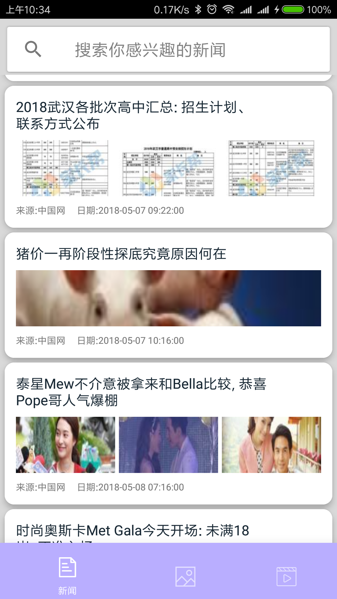
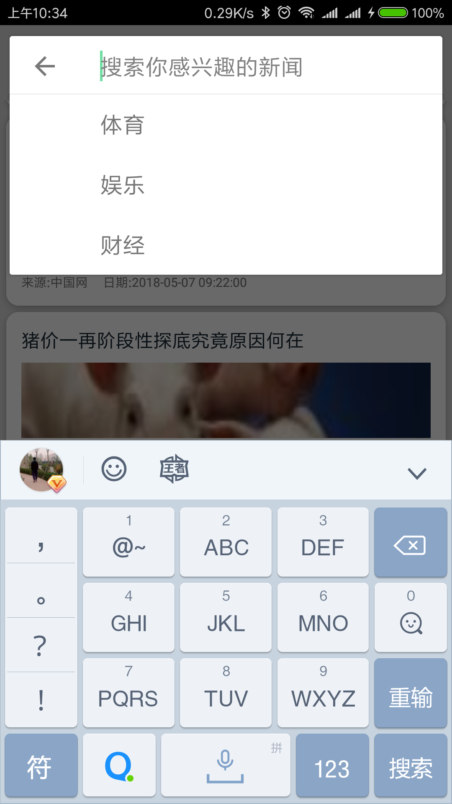
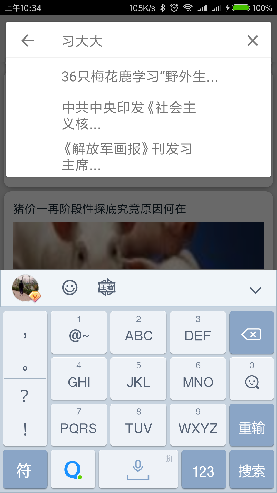
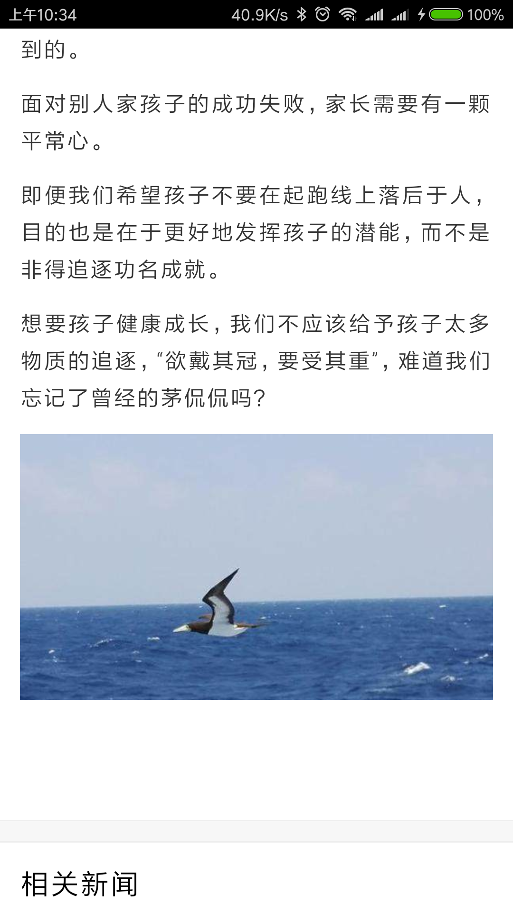
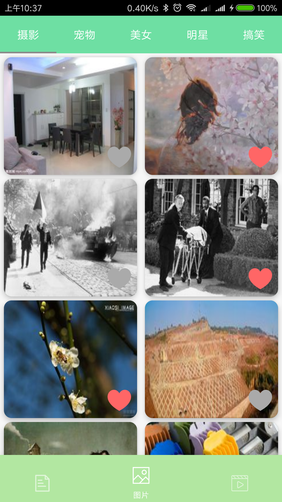
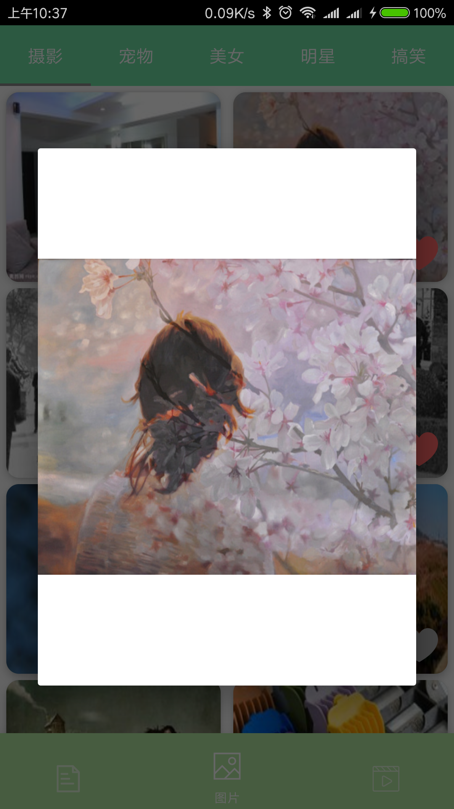
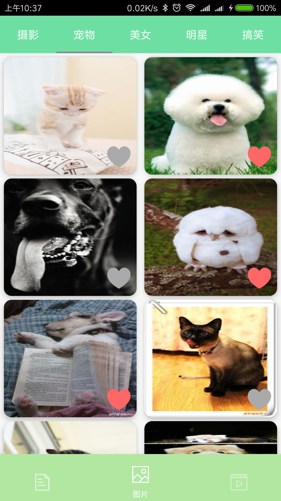
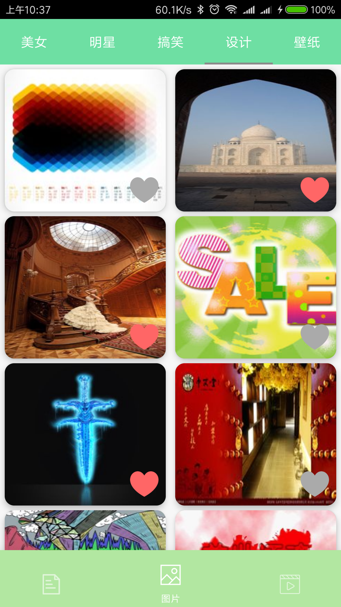
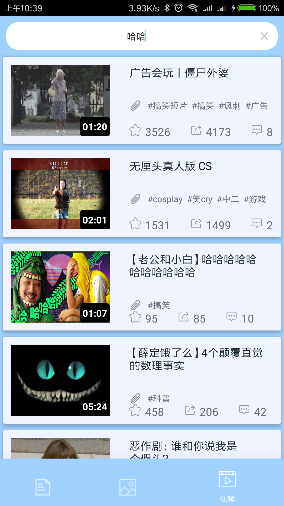
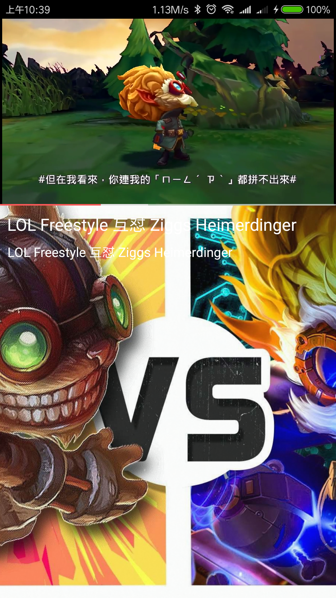

# DM

基于Kotlin编写的android项目
----
## 项目简介
>1.用kotlin编写的一个android练手项目

>2.MVP设计

>3.Retrofit2+Rxjava进行网络请求，并进行了一些封装

>4.一些简单的自定义view

## 项目预览
```
新闻页
```
<table>
    <tr>
        <td></td>
        <td></td>
    </tr>
  <tr>
        <td></td>
        <td> </td>
    </tr>
</table>
 
```
图片页
```
 
<br/>
 

```
视频页
```
 
<br/>
 
